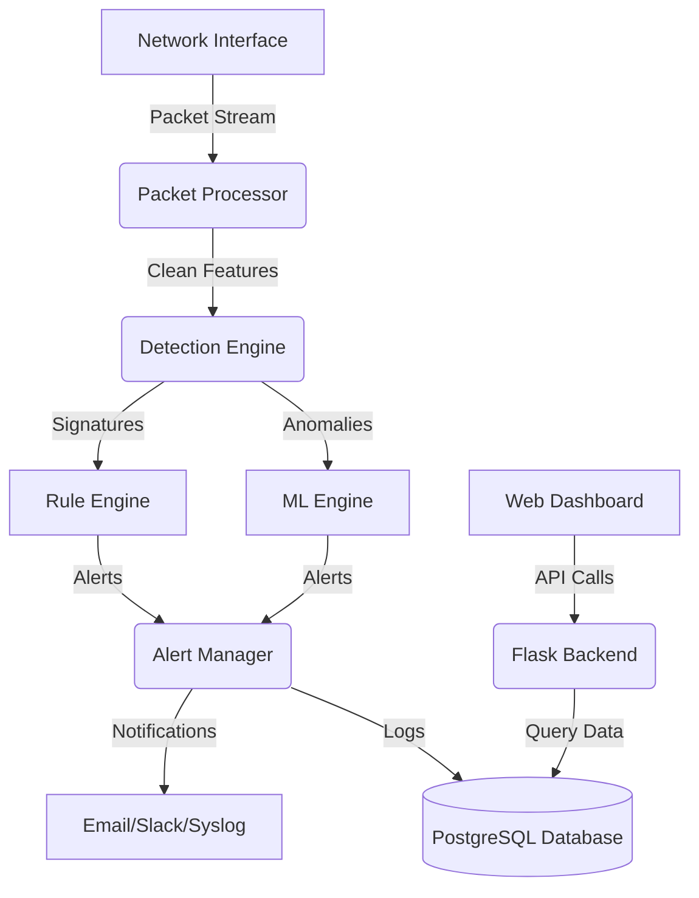

# Project Architecture

This document describes the high-level architecture of the Network Intrusion Detection System (NIDS), explaining the data flow and the interaction between various components.

## Architecture Overview

The NIDS is designed as a modular, scalable system that combines traditional signature-based detection with advanced machine learning anomalies detection.

## Core Components

### 1. Packet Processor (`src/packet_processor.py`)
- **Responsibility**: Interfaces with the network driver using Scapy/libpcap.
- **Functions**:
  - Captures raw packets in real-time.
  - Decodes protocols (IP, TCP, UDP, ICMP, etc.).
  - Handles packet defragmentation and flow reassembly.
  - Performs initial cleaning and normalization.

### 2. Feature Extractor (`src/feature_extractor.py`)
- **Responsibility**: Transforms raw packet data into numerical features suitable for ML models.
- **Features**:
  - Statistical features (packet count, byte count, duration).
  - Protocol-specific features (flags, window size, TTL).
  - Behavioral features (connection rate, source/dest entropy).
- **Output**: A feature vector representing a specific network flow or time window.

### 3. Detection Engine (`src/detection/`)

#### Rule Engine (`rule_engine.py`)
- **Method**: Signature-based matching.
- **Function**: Compares incoming traffic against a database of known attack signatures (e.g., specific port scans, malformed packets).
- **Pros**: High accuracy for known threats, low false positives.

#### ML Engine (`ml/models.py`)
- **Method**: Behavioral anomaly detection.
- **Algorithms**:
  - **Random Forest**: For multi-class attack classification.
  - **Isolation Forest**: For unsupervised anomaly detection (finding "unknown" attacks).
  - **LSTM (Deep Learning)**: For detecting time-series based attacks like slow DDoS.
- **Pros**: Detects zero-day attacks and complex behavioral patterns.

### 4. Alert Manager (`src/alerts/alerter.py`)
- **Responsibility**: Centralized handling of all security events.
- **Workflow**:
  - Receives alerts from detection engines.
  - Performs alert correlation and deduplication.
  - Assigns severity levels based on business impact.
  - Dispatches notifications via configured channels (Slack, Email, Discord).

### 5. Web Dashboard (`src/web/`)
- **Backend**: Flask-based REST API that serves data from the database.
- **Frontend**: React/Chart.js dashboard for real-time visualization of network health, attack maps, and traffic trends.

## Data Flow

1. **Ingestion**: Raw packets are captured from the physical or virtual network interface.
2. **Transformation**: Packets are grouped into "flows" and converted into 42-dimensional feature vectors.
3. **Analysis**: The feature vectors are passed through the hybrid detection pipeline.
4. **Action**: If an anomaly or signature match is found, an alert is generated.
5. **Persistence**: Every alert and periodic traffic summary is stored in PostgreSQL for historical analysis and model retraining.
6. **Visualization**: The administrator views the results via the web interface.

## Scalability & Performance

- **Multi-threading**: The packet processor and feature extractor run in dedicated threads to prevent packet loss during high traffic.
- **Asynchronous Alerts**: Alert dispatching is handled by an asynchronous queue (e.g., Celery/Redis) to avoid blocking the detection pipeline.
- **Database Indexing**: PostgreSQL tables are partitioned by timestamp to ensure fast queries on millions of records.

---

**Last Updated**: January 2026  
**Author**: Panger Lkr (NexusCipherGuard India)
